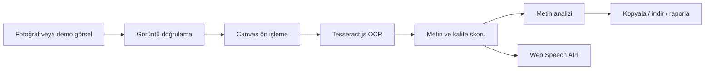

# Sesli Yazı Asistanı

Fotoğraftaki yazıları OCR ile metne çeviren, kalite skorunu gösteren ve metni Türkçe seslendirebilen demo hazır web uygulaması.

[](https://github.com/MehmetcanMutlu/ai-sesli-ceviri-araci/actions/workflows/smoke.yml)

## Kısa Özet

Sesli Yazı Asistanı; öğrenciler, görme zorluğu yaşayan kullanıcılar, saha çalışanları ve hızlı belge okuma ihtiyacı olan kişiler için geliştirildi. Kullanıcı bir fotoğraf yükler, uygulama görseldeki yazıyı OCR ile çıkarır, kalite skorunu hesaplar, metni düzenlenebilir hale getirir ve tarayıcıdaki ses motoru ile seslendirir.

Bu proje özel veya ücretli API gerektirmez. OCR işlemi Tesseract.js ile tarayıcı tarafında yapılır; metinden sese dönüşüm için Web Speech API kullanılır.

## Problem ve Çözüm

| Başlık | Açıklama |
| --- | --- |
| Problem | Fotoğraftaki yazıları okumak, özellikle düşük ışıkta, küçük yazıda veya erişilebilirlik ihtiyacında zor olabilir. |
| Çözüm | Görseli iyileştir, OCR ile metni çıkar, kalite skorunu göster, metni düzenlenebilir yap ve sesli oku. |
| Kullanıcı değeri | Kullanıcı yazıyı yeniden yazmak zorunda kalmaz; sonucu anında dinleyebilir, kopyalayabilir veya indirebilir. |
| Pazar potansiyeli | Eğitim, erişilebilirlik, ofis, saha operasyonu ve hızlı belge okuma senaryolarında kullanılabilir. |

## Öne Çıkan Özellikler

- Fotoğraf yükleme veya mobil cihazda kameradan seçme
- Türkçe + İngilizce OCR
- OCR öncesi otomatik görüntü iyileştirme
- OCR kalite skoru ve düşük kalite uyarıları
- Dosya adı, dosya boyutu ve OCR raporu
- Satır, kelime ve tahmini okuma süresi analizi
- Metni düzenleme, temizleme, kopyalama ve `.txt` olarak indirme
- Tarayıcı üzerinden metni seslendirme
- Ses, hız ve ton seçimi
- Dil, görüntü iyileştirme ve ses ayarlarını tarayıcıda hatırlama
- Hazır demo testleri: Türkçe karakter, İngilizce, düşük kontrast ve metin seslendirme
- Playwright ile otomatik smoke test
- GitHub Actions ile CI tabanlı test akışı

## Yapay Zeka Bileşenleri

| Bileşen | Kullanım |
| --- | --- |
| Tesseract.js OCR | Fotoğraftaki yazıyı metne dönüştürür. |
| Türkçe/İngilizce dil modelleri | Türkçe karakterleri ve İngilizce metinleri tanımak için kullanılır. |
| Görüntü ön işleme | Canvas üzerinde yeniden boyutlandırma, gri tonlama, kontrast artırma ve düşük kontrastta eşikleme yapılır. |
| OCR kalite skoru | OCR sonucunun güvenilirliğini kullanıcıya gösterir. |
| Web Speech API | Metni seçilen tarayıcı sesiyle seslendirir. |

## Mimari



## Değerlendirme Kriterleriyle Eşleşme

| Kriter | Projedeki kanıt |
| --- | --- |
| Yarışmaya hazır, çalışan proje | Statik web uygulaması çalışır; `npm test` ile otomatik test edilir. |
| Özgünlük | OCR, kalite skoru, metin analizi, rapor ve seslendirme tek deneyimde birleşir. |
| Ürün tamamlanma puanı | Temel kullanıcı akışı uçtan uca tamamdır: görsel yükle, OCR yap, düzenle, dinle, raporla. |
| Pazar uygunluğu | Erişilebilirlik, eğitim ve hızlı belge okuma ihtiyacına karşılık verir. |
| İhtiyaç ve çözüm eşleşmesi | Fotoğraftaki yazıyı okuyamama veya hızlı dinleme ihtiyacına doğrudan çözüm üretir. |
| Kullanıcı değeri ve deneyimi | Tek ekranlı arayüz, kalite uyarıları, ayar kalıcılığı ve hazır demo örnekleri vardır. |
| Fonksiyonel yeterlilik | OCR, TTS, görüntü iyileştirme, dosya kontrolü, rapor ve testler çalışır. |
| Ürün bütünlüğü | README, demo rehberi, değerlendirme eşlemesi, CI workflow ve smoke testler birlikte sunulur. |
| Yapay zeka öğeleri | Tesseract.js OCR, dil modelleri, görüntü ön işleme ve Web Speech API kullanılır. |

Daha ayrıntılı eşleme için: [docs/degerlendirme-kriterleri.md](docs/degerlendirme-kriterleri.md)

## Kurulum ve Çalıştırma

Bu proje derleme gerektirmez. Yerel sunucu ile çalıştırmak yeterlidir.

```bash
python3 -m http.server 5173
```

Tarayıcıda açın:

```text
http://localhost:5173
```

Node.js varsa aynı işlem şu komutla da yapılabilir:

```bash
npm run dev
```

## Test

Bağımlılıkları yükleyin:

```bash
npm install
```

Statik kontroller:

```bash
npm run check
```

Tam smoke test:

```bash
npm test
```

Smoke test kapsamı:

- Sayfa konsol hatasız açılır.
- Başlangıç buton durumları doğrudur.
- Metin analizi çalışır.
- Ayarlar tarayıcıda kalıcıdır.
- Görsel olmayan dosya reddedilir.
- Türkçe karakter OCR testi geçer.
- İngilizce OCR testi geçer.
- Düşük kontrast senaryosu bozulmadan okunur.
- Mobil görünümde yatay taşma olmaz.

## Demo Akışı

1. Deneme Merkezi'nden `Türkçe karakter` örneğini çalıştırın.
2. OCR kalite skorunu, dosya bilgisini ve metin analizini gösterin.
3. Metni düzenleyip `Seslendir` butonuna basın.
4. `Düşük kontrast` örneğiyle görüntü iyileştirme katmanını gösterin.
5. OCR raporunu kopyalayarak teknik çıktıyı gösterin.

Detaylı sunum akışı: [docs/demo-rehberi.md](docs/demo-rehberi.md)

## Dosya Yapısı

```text
.
├── index.html
├── styles.css
├── app.js
├── package.json
├── tests/
│   └── smoke.test.js
├── docs/
│   ├── degerlendirme-kriterleri.md
│   └── demo-rehberi.md
└── .github/
    └── workflows/
        └── smoke.yml
```

## Teknoloji Seçimi

| Teknoloji | Neden seçildi? |
| --- | --- |
| HTML/CSS/JavaScript | Hızlı, kurulumsuz ve GitHub Pages uyumlu statik yapı sağlar. |
| Tesseract.js | Tarayıcıda çalışan ücretsiz OCR motorudur. |
| Web Speech API | Ek servis olmadan metni seslendirebilir. |
| Playwright | Tarayıcı üzerinden gerçek kullanıcı akışlarını test eder. |
| GitHub Actions | Push ve pull requestlerde otomatik smoke test çalıştırır. |

## Kısıtlar ve Gelecek Geliştirmeler

- El yazısı ve çok bulanık fotoğraflarda OCR doğruluğu düşebilir.
- İlk OCR kullanımında Tesseract.js dil dosyaları internetten yüklenir.
- Tarayıcıdaki Türkçe ses kalitesi işletim sistemine bağlıdır.
- Gelecekte kırpma aracı, PDF desteği, offline cache ve isteğe bağlı bulut OCR adaptörü eklenebilir.

## Canlıya Alma

Proje statik olduğu için GitHub Pages, Netlify veya Vercel üzerinde doğrudan yayınlanabilir. Ana giriş dosyası `index.html` olduğu için ek build adımı gerekmez.
