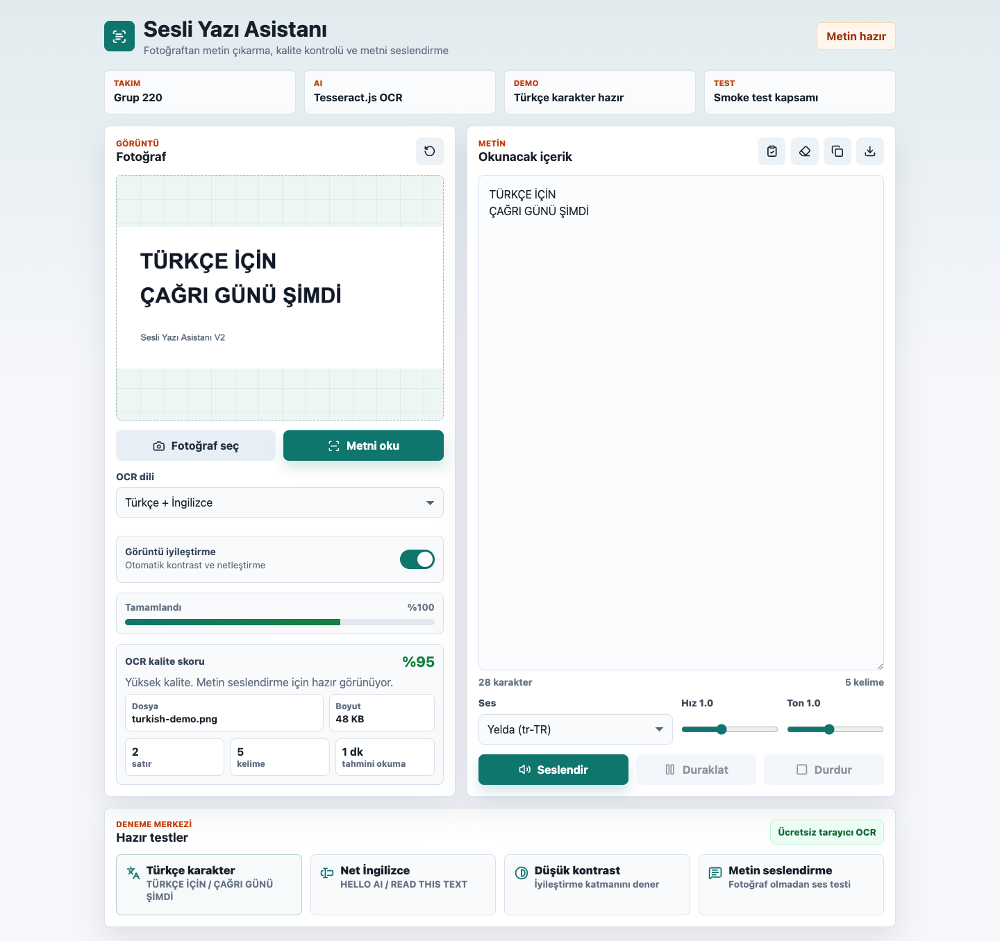
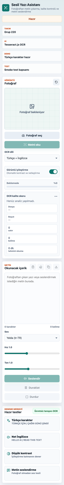
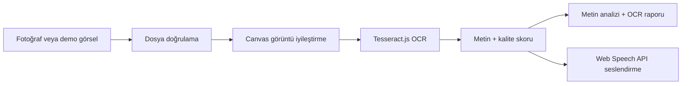

# **Takım İsmi**

Grup 220

# Ürün İle İlgili Bilgiler

## Takım Elemanları

- Mehmetcan Mutlu: Product Owner / Developer
- Nesibe Nilay Coşar: Scrum Master / Product & UX

## Ürün İsmi

--Sesli Yazı Asistanı--

## Ürün Açıklaması

Sesli Yazı Asistanı, fotoğraftaki yazıları OCR ile metne dönüştüren ve metni tarayıcı üzerinden sesli okuyabilen yapay zeka destekli bir web uygulamasıdır. Kullanıcı bir fotoğraf yükler veya mobil cihazdan kamera ile seçer; uygulama görseli OCR öncesi iyileştirir, yazıyı çıkarır, kalite skorunu gösterir, metni düzenlenebilir hale getirir ve seslendirme kontrolleriyle okunmasını sağlar.

Proje özellikle erişilebilirlik, eğitim, hızlı belge okuma ve saha kullanımı gibi senaryolara odaklanır. Harici ücretli API kullanılmadan Tesseract.js OCR motoru ve Web Speech API ile çalışır.

## Ürün Özellikleri

- Fotoğraf yükleme veya mobil cihazdan kamera ile görsel seçme
- Türkçe + İngilizce OCR desteği
- OCR öncesi otomatik görüntü iyileştirme
- OCR kalite skoru ve düşük kalite uyarıları
- Dosya adı, dosya boyutu ve OCR raporu üretimi
- Satır, kelime ve tahmini okuma süresi analizi
- Metni düzenleme, temizleme, kopyalama ve `.txt` olarak indirme
- Web Speech API ile metni seslendirme
- Ses, hız ve ton seçimi
- Ayarların tarayıcıda hatırlanması
- Hazır demo senaryoları: Türkçe karakter, İngilizce, düşük kontrast ve metin seslendirme
- Playwright smoke testleri ve GitHub Actions test workflow'u

## Hedef Kitle

- Görme zorluğu yaşayan kullanıcılar
- Öğrenciler ve öğretmenler
- Basılı notları hızlıca dijitale aktarmak isteyen kişiler
- Saha çalışanları
- Ofis ve belge okuma ihtiyacı olan kullanıcılar
- Türkçe OCR ve seslendirme desteğine ihtiyaç duyan kullanıcılar

## Product Backlog URL

[GitHub Backlog / Issues](https://github.com/MehmetcanMutlu/ai-sesli-ceviri-araci/issues)

## Proje Linkleri

- [GitHub Repository](https://github.com/MehmetcanMutlu/ai-sesli-ceviri-araci)
- [Değerlendirme Kriterleri Eşlemesi](docs/degerlendirme-kriterleri.md)
- [Demo Rehberi](docs/demo-rehberi.md)

---

# Değerlendirme Kriterleri İçin Özet

| Kriter | Projedeki karşılığı |
| --- | --- |
| Yarışmaya hazır, çalışan proje | Statik web uygulaması çalışır; `npm test` ile otomatik test edilir. |
| Özgünlük | OCR, kalite skoru, metin analizi, OCR raporu ve seslendirme tek deneyimde birleşir. |
| Ürün tamamlanma puanı | Görsel yükleme, OCR, metin düzenleme, seslendirme, rapor ve test akışı tamamdır. |
| Pazara uygunluk | Erişilebilirlik, eğitim, ofis ve saha kullanımına doğrudan değer üretir. |
| Yapay zeka öğeleri | Tesseract.js OCR, Türkçe/İngilizce dil modelleri, görüntü ön işleme ve Web Speech API kullanılır. |
| Ürün bütünlüğü | README, demo rehberi, değerlendirme dokümanı, testler ve CI workflow birlikte sunulur. |

---

# Kurulum ve Çalıştırma

Proje derleme gerektirmez. Yerel sunucu açmak yeterlidir.

```bash
python3 -m http.server 5173
```

Tarayıcıda açın:

```text
http://localhost:5173
```

Node.js varsa:

```bash
npm run dev
```

## Test

```bash
npm install
npm run check
npm test
```

Test kapsamı:

- Sayfa konsol hatasız açılır.
- Başlangıç buton durumları doğrudur.
- Metin analizi çalışır.
- Ayarlar tarayıcıda kalıcıdır.
- Görsel olmayan dosya reddedilir.
- Türkçe karakter OCR testi geçer.
- İngilizce OCR testi geçer.
- Düşük kontrast senaryosu okunur.
- OCR rapor arayüzü aktifleşir.
- Mobil görünümde yatay taşma olmaz.

---

# Sprint 1

- **Sprint Notları**: Projenin ana problemi ve MVP kapsamı belirlendi. Kullanıcının fotoğraftaki yazıyı metne dönüştürüp sesli dinleyebilmesi temel hedef olarak seçildi.

- **Sprint içinde tamamlanması tahmin edilen puan**: 100 puan

- **Puan tamamlama mantığı**: Toplam proje backlog'u 300 puan olarak planlandı. Sprint 1 için 100 puanlık MVP kapsamı hedeflendi.

- **Backlog düzeni ve Story seçimleri**: Backlog, önce çalışan temel ürün çıkacak şekilde düzenlendi. İlk sprintte görsel yükleme, OCR, metin alanı ve seslendirme akışı seçildi.

| Story | Puan | Durum |
| --- | ---: | --- |
| Kullanıcı fotoğraf yükleyebilmeli | 20 | Tamamlandı |
| Fotoğraftaki yazı OCR ile okunabilmeli | 30 | Tamamlandı |
| Çıkan metin düzenlenebilmeli | 15 | Tamamlandı |
| Metin seslendirilebilmeli | 25 | Tamamlandı |
| Temel responsive arayüz kurulmalı | 10 | Tamamlandı |

- **Daily Scrum**: İletişim çevrim içi mesajlaşma üzerinden yürütüldü. Günlük kontrol başlıkları; bir önceki gün yapılanlar, bugünün hedefi ve engeller olarak belirlendi.

- **Sprint board update**: Backlog GitHub Issues ve README sprint tabloları üzerinden takip edilecek şekilde planlandı.

- **Ürün Durumu**: Sprint sonunda temel OCR + seslendirme akışı çalışan hale getirildi.

- **Sprint Review**: Fotoğraf yükleme, OCR ve seslendirme akışı demo edildi. Temel ürün akışının çalıştığı görüldü. Sonraki sprintte kalite skoru, görüntü iyileştirme ve demo merkezi eklenmesine karar verildi.

- **Sprint Retrospective**:
  - OCR doğruluğu için görüntü ön işleme katmanı eklenmeli.
  - Türkçe karakter testleri ayrı demo senaryosu olarak hazırlanmalı.
  - Test otomasyonu sonraki sprintte eklenmeli.

---

# Sprint 2

- **Sprint Notları**: MVP üzerine ürün kalitesini artıran özellikler eklendi. Amaç sadece OCR yapmak değil, sonucun güvenilirliğini kullanıcıya anlatan bir deneyim oluşturmaktı.

- **Sprint içinde tamamlanması tahmin edilen puan**: 100 puan

- **Puan tamamlama mantığı**: Sprint 2, ürünün kullanılabilirliğini ve teknik güvenilirliğini artıran özelliklere ayrıldı.

- **Backlog düzeni ve Story seçimleri**:

| Story | Puan | Durum |
| --- | ---: | --- |
| Görüntü iyileştirme katmanı eklenmeli | 25 | Tamamlandı |
| OCR kalite skoru gösterilmeli | 20 | Tamamlandı |
| Türkçe karakter demo testi hazırlanmalı | 15 | Tamamlandı |
| Düşük kontrast demo senaryosu hazırlanmalı | 15 | Tamamlandı |
| Metin analizi ve ayar kalıcılığı eklenmeli | 15 | Tamamlandı |
| Playwright smoke test kurulmalı | 10 | Tamamlandı |

- **Daily Scrum**: Sprint süresince OCR çıktıları, tarayıcı sesleri ve responsive arayüz üzerinde kısa ilerleme kontrolleri yapıldı.

- **Sprint board update**: Test senaryoları ve kullanıcı akışı README üzerinden görünür hale getirildi.

- **Ürün Durumu**: Ekran görüntüleri:





- **Sprint Review**: Görüntü iyileştirme, kalite skoru, metin analizi, demo merkezi ve smoke testler tamamlandı. Türkçe karakterlerin net demo görselinde doğru okunduğu doğrulandı.

- **Sprint Retrospective**:
  - README değerlendirme formatına daha sıkı uyarlanmalı.
  - Demo sırasında jüriye gösterilecek kısa akış hazırlanmalı.
  - GitHub Actions ile otomatik test görünürlüğü eklenmeli.

---

# Sprint 3

- **Sprint Notları**: Final teslim formatı, dokümantasyon, test kanıtı ve sunum akışı güçlendirildi.

- **Sprint içinde tamamlanması tahmin edilen puan**: 100 puan

- **Puan tamamlama mantığı**: Son sprint; ürün bütünlüğü, değerlendirme kriterleri, canlıya alınabilirlik ve final sunum kalitesi için ayrıldı.

- **Backlog düzeni ve Story seçimleri**:

| Story | Puan | Durum |
| --- | ---: | --- |
| README bootcamp şablonuna uygun hale getirilmeli | 25 | Tamamlandı |
| Değerlendirme kriterleri eşleme dokümanı eklenmeli | 15 | Tamamlandı |
| Demo rehberi hazırlanmalı | 15 | Tamamlandı |
| OCR raporu üretimi eklenmeli | 15 | Tamamlandı |
| GitHub Actions smoke workflow eklenmeli | 15 | Tamamlandı |
| Arayüz final görsel düzeni iyileştirilmeli | 15 | Tamamlandı |

- **Daily Scrum**: Final sprintinde kontroller; README formatı, testlerin geçmesi, GitHub dosya görünümü ve demo anlatımı üzerinden yapıldı.

- **Sprint board update**: Sprint 3 çıktıları commit geçmişi ve README bölümleri üzerinden izlenebilir hale getirildi.

- **Ürün Durumu**: Proje finalde çalışır, test edilebilir ve statik olarak canlıya alınabilir durumdadır.

- **Sprint Review**: Ürün; ihtiyaç-çözüm eşleşmesi, kullanıcı değeri, yapay zeka öğeleri, fonksiyonel yeterlilik ve ürün bütünlüğü açısından gözden geçirildi. README, demo rehberi, değerlendirme dokümanı ve test workflow'u tamamlandı.

- **Sprint Retrospective**:
  - Proje tesliminde README formatının değerlendirme için kritik olduğu görüldü.
  - Testlerin GitHub Actions'a taşınması ürün güvenilirliğini artırdı.
  - Gelecekte PDF desteği, kırpma aracı ve offline cache eklenebilir.

---

# Teknoloji ve Mimari



| Teknoloji | Kullanım nedeni |
| --- | --- |
| HTML/CSS/JavaScript | Kurulumsuz, hızlı ve statik yayınlanabilir yapı sağlar. |
| Tesseract.js | Tarayıcıda çalışan ücretsiz OCR motorudur. |
| Web Speech API | Harici servis olmadan metin seslendirme sağlar. |
| Playwright | Gerçek tarayıcı üzerinden smoke test çalıştırır. |
| GitHub Actions | Push ve pull requestlerde otomatik test çalıştırır. |

# Gelecek Geliştirmeler

- PDF ve çok sayfalı belge desteği
- Görsel kırpma ve döndürme aracı
- Offline cache
- İsteğe bağlı bulut OCR adaptörü
- Ses çıktısını dosya olarak indirme
